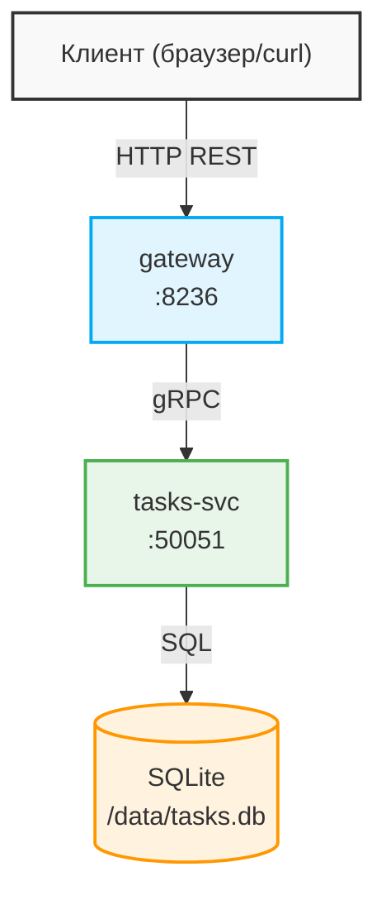

# Architecture — tasks-s22

## Обзор

Система состоит из двух микросервисов:



## Сервисы

### gateway

- **Роль**: REST API для клиентов. Принимает HTTP-запросы и перенаправляет их в tasks-svc через gRPC.
- **Порт**: `8236`
- **Стек**: Python, FastAPI, uvicorn, grpcio
- **Эндпоинты**:
  - `GET    /api/tasks` — список задач
  - `GET    /api/tasks/{id}` — одна задача
  - `POST   /api/tasks` — создать задачу
  - `PUT    /api/tasks/{id}` — обновить задачу
  - `DELETE /api/tasks/{id}` — удалить задачу
  - `GET    /health` — healthcheck

### tasks-svc

- **Роль**: бизнес-логика и хранение данных. Слушает gRPC-запросы от gateway.
- **Порт**: `50051` (gRPC, не открыт наружу)
- **Стек**: Python, grpcio, SQLite
- **proto-пакет**: `tasks.v1`
- **gRPC-сервис**: `TasksService`
  - `ListTasks` / `GetTask` / `CreateTask` / `UpdateTask` / `DeleteTask`

## Модель данных

```sql
CREATE TABLE tasks (
    id    INTEGER PRIMARY KEY AUTOINCREMENT,
    title TEXT NOT NULL,
    due   TEXT NOT NULL DEFAULT '',
    done  INTEGER NOT NULL DEFAULT 0
);
```

## Протоколы

| Направление         | Протокол  | Причина                             |
| ------------------- | --------- | ----------------------------------- |
| Клиент -> gateway    | REST/HTTP | Универсально, легко тестировать     |
| gateway -> tasks-svc | gRPC      | Быстро, типизировано, inter-service |

## Запуск

```bash
docker compose up --build
```

## CI/CD

GitHub Actions (`.github/workflows/ci.yml`):

1. Линтинг Python-файлов
2. `docker compose build`
3. Smoke-тест: поднять стек -> `GET /health` -> `docker compose down`
